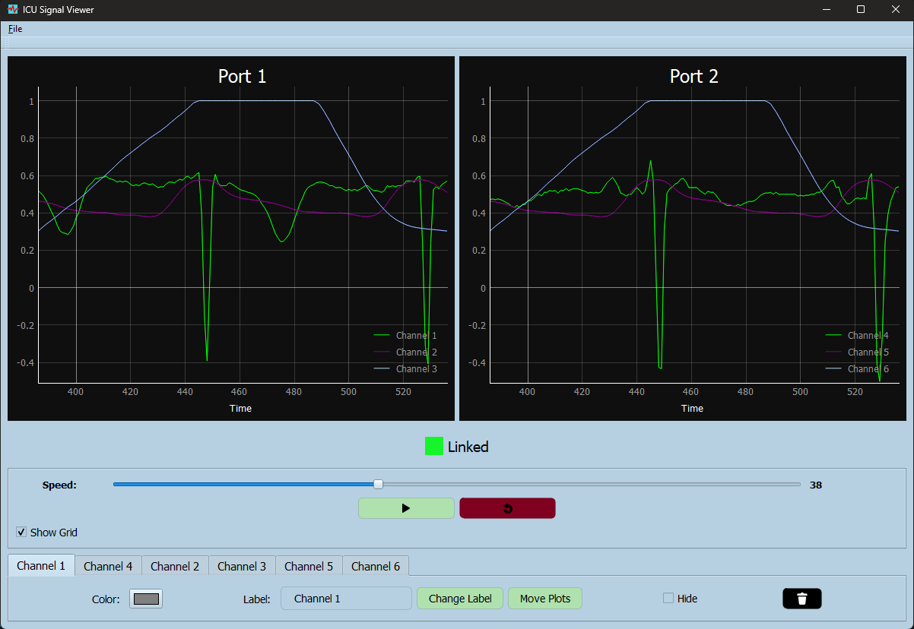
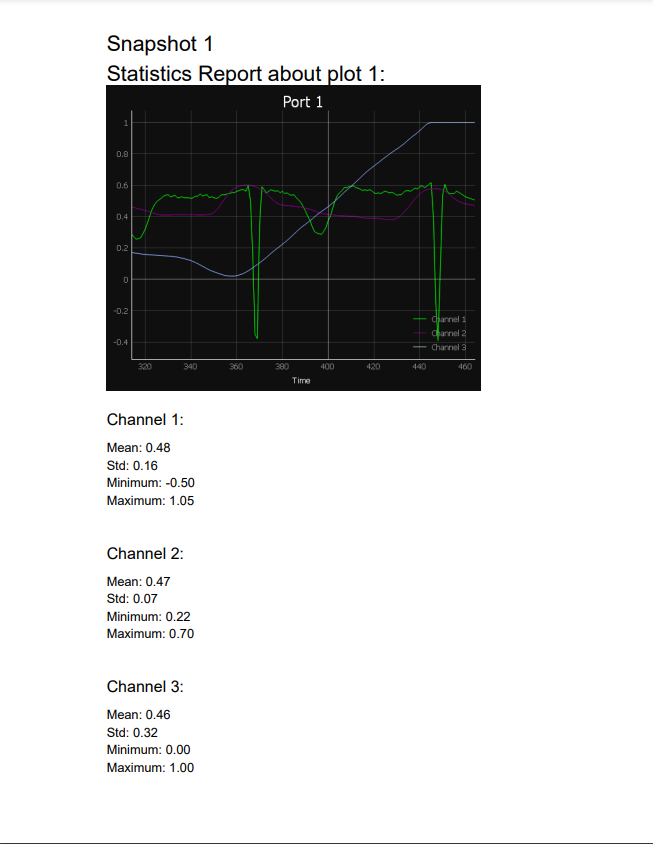

<!DOCTYPE html>
<html lang="en">

<head>
  <meta charset="UTF-8">
  <meta name="viewport" content="width=device-width, initial-scale=1.0">
</head>

<body>

  <h1>Multi-Port, Multi-Channel Signal Viewer</h1>

  
Monitoring vital signals is crucial in any ICU setting. This desktop application, developed using Python and Qt, serves as a comprehensive multi-port, multi-channel signal viewer. It allows users to explore various medical signals (e.g., ECG, EMG, EEG) with examples of both normal and abnormal signal types.

  <h2>Features</h2>

  <h3>Signal Visualization</h3>
  <ul>
    <li>Browse your PC to open any signal file.</li>
    <li>Two main identical graphs with independent controls.</li>
    <li>Link graphs for synchronized time frames, signal speed, and viewport adjustments.</li>
    <li>Cine mode for running signals in real-time, similar to ICU monitors.</li>
    <li>Rewind option to restart the signal when it ends.</li>
  </ul>

  <h3>User Controls</h3>
  <ul>
    <li>Change color of signals.</li>
    <li>Add labels/titles for each signal.</li>
    <li>Show/hide signals.</li>
    <li>Control/customize cine speed.</li>
    <li>Zoom in/out functionality.</li>
    <li>Pause/play/rewind signals.</li>
    <li>Scroll/pan signals in any direction using sliders or mouse movements.</li>
    <li>Move signals between graphs.</li>
  </ul>

  <h3>Boundary Conditions</h3>
  <ul>
    <li>Ensure boundary conditions are met during manipulations.</li>
    <li>No scroll/pan allowed before the signal starts or after it ends, or beyond maximum/minimum values.</li>
  </ul>

  <h3>Exporting & Reporting</h3>
  <ul>
    <li>Construct a report with snapshots and data statistics in a PDF file.</li>
    <li>Generate PDF content through code, not by converting snapshot images.</li>
    <li>Data statistics include mean, std, min, and max values for each signal.</li>
    <li>Single or multi-page reports available.</li>
    <li>Prepare samples for different numbers of signals and snapshots.</li>
  </ul>

  <h2>Screenshots</h2>

  
  

  <h2>Getting Started</h2>

  <ol>
    <li>Clone the repository.</li>
    <pre><code>git clone https://github.com/your-username/signal-viewer.git</code></pre>
    <li>Install dependencies.</li>
    <pre><code>
        pip install pyqt5
        pip install numpy
        pip install pandas
        pip install pymupdf
        pip install fitz
        pip install pyqtgraph
    </code></pre>
    <li>Run the application.</li>
    <pre><code>python signal_viewer.py</code></pre>
  </ol>

  <h2>How to Use</h2>

  <ol>
    <li>Open the application.</li>
    <li>Browse and open signal files.</li>
    <li>Explore the features and controls.</li>
    <li>Generate reports for analysis.</li>
  </ol>

  
Feel free to contribute, report issues, or suggest improvements!

  <h2>Contributors</h2>
  <ul>
    <li><a href="https://github.com/AssemSadek90">Assem Sadek</a></li>
  </ul>

  <h2>License</h2>
  
This project is licensed under the <a href="LICENSE">MIT License</a>.

</body>

</html>
